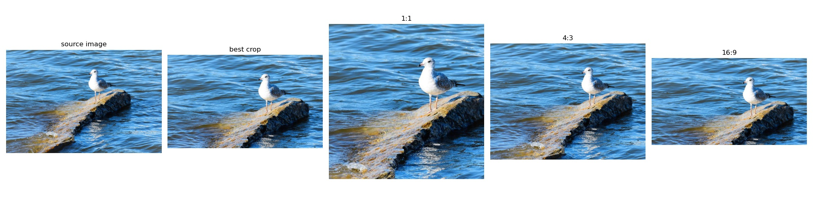
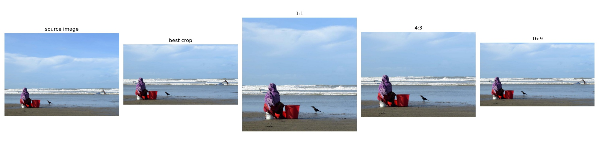
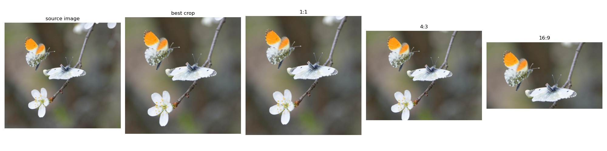

# GAIC-PyTorch
This is an unofficial PyTorch implementation of [Grid Anchor based Image Cropping: A New Benchmark and An Efficient Model](https://arxiv.org/pdf/1909.08989.pdf?ref=https://githubhelp.com), which is the journal version and extension of [Reliable and Efficient Image Cropping: A Grid Anchor based Approach](https://arxiv.org/pdf/1904.04441.pdf). 
We provide demo code to produce the best cropping results with different aspect ratios (1:1, 4:3, and 16:9) for arbitrary test images.
Moreover, this code is also able to generate crops with arbitrary specified aspect ratios.

<div  align="center">

</div>
<div  align="center">

</div>
<div  align="center">

</div>

### Requirements
- PyTorch>=1.0

You can install packages using pip according to [``requirements.txt``](./requirements.txt): 

```Shell
pip install -r requirements.txt
```

### Installation
1. Get the code. We will call the directory that you cloned into `$PRJ_ROOT`.
```Shell
git clone https://github.com/bo-zhang-cs/GAIC-Pytorch.git
```

2. Build the RoI&RoDAlign libraries. The source code of RoI&RoDAlign is from [[here]](https://github.com/lld533/Grid-Anchor-based-Image-Cropping-Pytorch) compatible with PyTorch 1.0 or later. If you use Pytorch 0.4.1, please refer to [[official implementation]](https://github.com/HuiZeng/Grid-Anchor-based-Image-Cropping-Pytorch).
```Shell
cd $PRJ_ROOT/untils
# Change the **CUDA_HOME** and **-arch=sm_86** in ``roi_align/make.sh`` and ``rod_align/make.sh`` according to your enviroment, respectively.
# Make sure these bash files (``make_all.sh, roi_align/make.sh, rod_align/make.sh``) are Unix text file format by runing ``:set ff=unix`` in VIM.
sudo bash make_all.sh
```

### Running Demo
1. Download pretrained models(~98MB) from [[Google Drive]](https://drive.google.com/file/d/1U_8C9oWOBT64LHtxZP1_0Uo9Ndw0QLsJ/view?usp=sharing) [[Baidu Cloud]](https://pan.baidu.com/s/1fmy18FD5_0v6vrab6OZKmQ)(access code: *webf*). By default, we assume the models (``*.pth``) is stored in `$PRJ_ROOT/pretrained_models`.

2. Predict best crops for the user's images.
```Shell
cd $PRJ_ROOT
python evaluate/demo.py --gpu 0 --image_dir $IMAGE_PATH/IMAGE_FOLDER --save_dir $RESULT_FOLDER
# or execute python evaluate/demo.py to predict best crops for the images in the test_images folder.
```

### Train/Evaluate
1. Download [GAICD dataset](https://github.com/HuiZeng/Grid-Anchor-based-Image-Cropping). And set the ``GAIC_folder`` in ``config.py`` and you can check the paths by running:
```Shell
cd $PRJ_ROOT
python dataset/cropping_dataset.py
```

2. Train your model and evaluate the model on the fly.
```Shell
cd $PRJ_ROOT
python train/train.py --gpu 0 --backbone vgg16
# or just running python train/train.py
```
The model performance for each epoch is also recorded in ``*.csv`` file under the produced ``experiments`` folder.
More model parameters and experimental settings can be found in ``config/GAIC_params.yaml``. 

3. Evaluate the pretrained model and reproduce the below quantitative results.
```Shell
cd $PRJ_ROOT
python evaluate/test.py 
```

### Performance on GAICD Dataset
| #Metric   | Backbone     | SRCC↑ | PCC↑  | Acc5↑|Acc1_5↑|Acc4_5↑|Acc10↑|Acc1_10↑|Acc4_10↑|
|:--:|:--:|:--:|:--:|:--:|:--:|:--:|:--:|:--:|:--:|
| Paper     | VGG16        | 0.777 | 0.800 | -    | 60.5 | 50.2 | -    |  77.5 | 70.6 |
| This code | VGG16        | 0.778 | 0.808 | 54.8 | 60.0 | 51.6 | 73.3 |  77.5 | 69.9 |
| Paper     | MobileNetV2  | 0.783 | 0.806 | -    | 62.5 | 52.5 | -    |  78.5 | 72.3 |
| This code | MobileNetV2  | 0.783 | 0.810 | 58.0 | 62.5 | 53.0 | 74.2 |  80.0 | 72.0 |
| Paper     | ShuffleNetV2 | 0.774 | 0.801 | -    | 61.5 | 52.0 | -    |  78.5 | 71.3 |
| This code | ShuffleNetV2 | 0.787 | 0.811 | 55.4 | 62.0 | 50.0 | 73.4 |  78.0 | 69.6 |

### Citation
```
@inproceedings{zhang2019deep,
  title={Reliable and Efficient Image Cropping: A Grid Anchor based Approach},
  author={Zeng, Hui, Li, Lida， Cao, Zisheng and Zhang, Lei},
  booktitle={IEEE Conference on Computer Vision and Pattern Recognition},
  year={2019}
}
@article{zeng2020cropping,
  title={Grid Anchor based Image Cropping: A New Benchmark and An Efficient Model},
  author={Zeng, Hui and Li, Lida and Cao, Zisheng and Zhang, Lei},
  journal={IEEE Transactions on Pattern Analysis and Machine Intelligence},
  volume={},
  number={},
  pages={},
  year={2020},
  publisher={IEEE}
}
```
